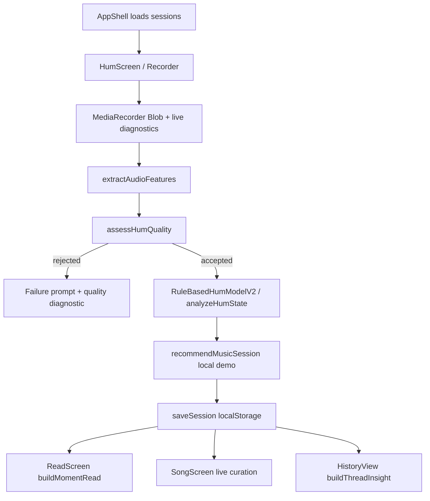
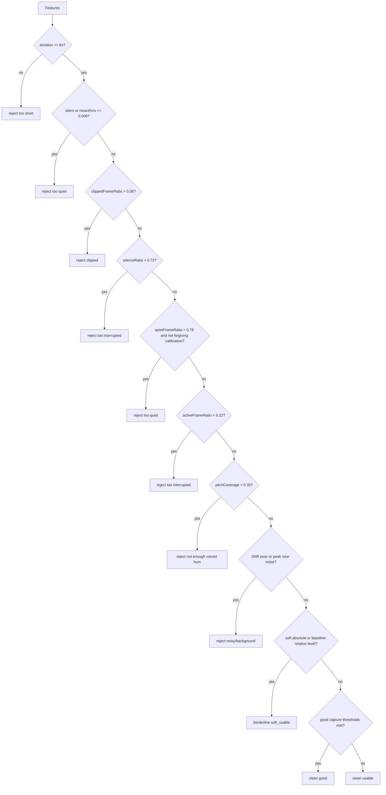
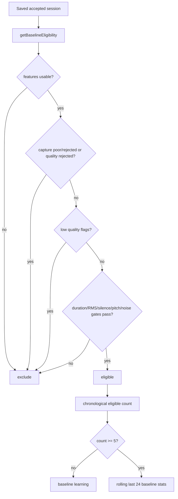
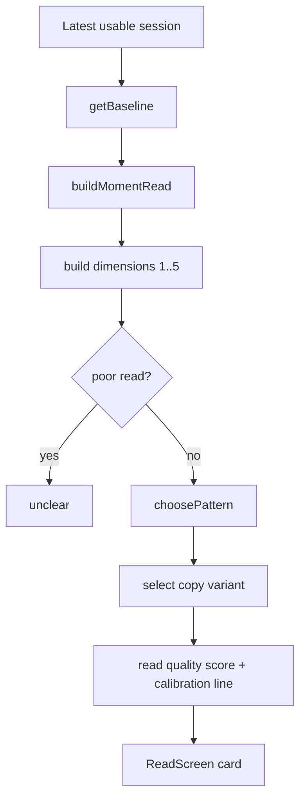
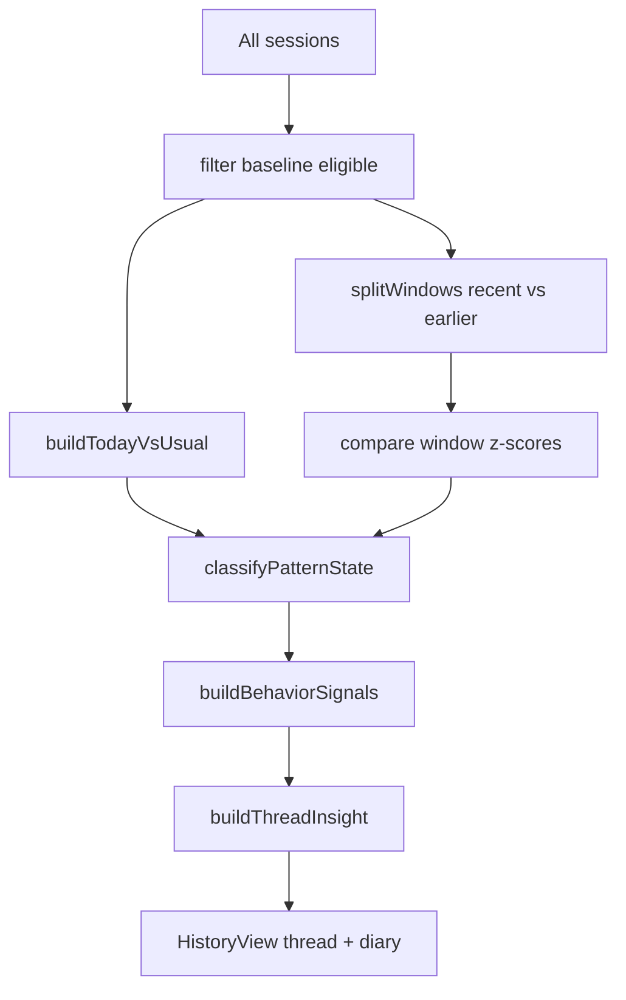

# Hum Systems Explainer

This document describes the implementation that exists in this repository today. It is based on source inspection, not product intent. When a rule, threshold, label, or storage field is documented, the source path and function or constant are cited.

Important scope note: the mounted app entry is `app/page.tsx -> components/app/AppShell.tsx`. That current app path uses `components/screens/HumScreen.tsx`, `ReadScreen.tsx`, `SongScreen.tsx`, and `ThreadScreen.tsx`. Older components including `components/HomeExperience.tsx`, `components/DailyMelodyCard.tsx`, and `components/SignalSummary.tsx` still contain a parallel legacy flow, but they are not mounted by `app/page.tsx` today.

## 1. Product Summary

Hum is a local-first voice ritual app. In the current app path, a user records one 12 second hum. The browser captures audio with `MediaRecorder`, decodes it locally with `AudioContext.decodeAudioData`, extracts acoustic features, runs signal quality gates, compares the sample with the user's personal baseline when enough eligible hums exist, builds a non-clinical "Today's read", offers a live song curation flow, and stores derived hum data locally.

Hum is not implemented as a medical or diagnostic system. The code does not validate anxiety, depression, stress, disorder, illness, or clinical state. The strongest technically accurate description is: Hum produces reflective, baseline-relative interpretations from vocal delivery features such as activation, steadiness, continuity, clarity, movement, and variability.

Current implementation summary:

| Stage | What happens | Main sources |
|---|---|---|
| Record | User records a 12 second hum in browser. | `components/Recorder.tsx`, `getHumAudioStream`, `startRecording` |
| Feature extraction | Blob is decoded locally and converted to acoustic features. | `lib/audioFeatures.ts`, `extractAudioFeatures` |
| Quality gate | Features are accepted, soft-usable, poor, or rejected. | `lib/quality.ts`, `assessHumQuality`, `getQualityGateDecision` |
| Baseline | Eligible hums form a rolling personal baseline after 5 eligible samples. | `lib/recommendation.ts`, `getBaseline`; `lib/baselineEligibility.ts` |
| State label | If baseline exists, rule-based v2 assigns a baseline-relative `SignalLabel`. | `lib/humModels.ts`, `RuleBasedHumModelV2`; `lib/recommendation.ts`, `analyzeHumState` |
| Today's read | UI read is built from feature dimensions, quality, baseline data, and copy variants. | `lib/momentRead.ts`, `buildMomentRead` |
| Song | A local demo recommendation is stored at capture; the current Song screen separately curates a Last.fm-backed live song. | `lib/musicRecommendation.ts`; `components/screens/SongScreen.tsx`; `lib/liveMusicProvider.ts`; `app/api/music/recommend/route.ts` |
| Diary/thread | Saved sessions become a local diary and thread insight. | `lib/storage.ts`; `lib/humInsightInterpretation.ts`; `lib/threadInsight.ts`; `components/HistoryView.tsx` |
| Local persistence | Hum sessions, derived features, feedback, song history, diagnostics, and settings are in browser storage. | `lib/storage.ts`, `HUM_STORAGE_KEYS`; `lib/liveMusicStorage.ts`; `lib/recordingAttempt.ts` |

## 2. End-to-End User Flow

1. App loads.

Current route `app/page.tsx` renders `AppShell` (`components/app/AppShell.tsx`). `AppShell` subscribes to local sessions with `useSyncExternalStore(subscribeToSessions, getSessions)` and renders one of four screens: Hum, Read, Song, Thread. UI surfaces: header, bottom navigation, settings panel, local-first sheet.

2. User starts a hum.

`HumScreen` renders `Recorder` (`components/screens/HumScreen.tsx`, `components/Recorder.tsx`). `Recorder.startRecording` creates a recording attempt id with `createRecordingAttemptId`, starts capture diagnostics, and requests a microphone stream through `getHumAudioStream`.

3. Microphone permission and recording begin.

`Recorder.startRecording` checks `navigator.mediaDevices.getUserMedia` and `MediaRecorder`. `getHumAudioStream` first requests `{ echoCancellation: false, noiseSuppression: false, autoGainControl: false }`; if that fails it falls back to `{ audio: true }`. Permission denial is detected by `isPermissionDeniedError` in `lib/recordingAttempt.ts` and shown with `getRecordingFailureCopy("permission_denied")`.

4. Live feedback / mic level / capture quality is shown.

`Recorder.startLevelMeter` creates `AudioContext`, `MediaStreamAudioSourceNode`, and `AnalyserNode`. Every animation frame, it computes raw RMS and peak amplitude, smooths RMS, maps to `LiveSignalMetrics` with `getLiveSignalMetrics`, estimates quality with `getLiveQualityEstimate`, and passes level/waveform to `RitualWaveform`. UI surfaces: `HumCoreVisualizer`, mic level meter, `getLiveFeedbackCopy` labels.

5. User completes recording.

The recorder starts with `mediaRecorder.start(1000)` and stops after `RECORDING_SECONDS * 1000`, where `RECORDING_SECONDS = 12` in `components/Recorder.tsx`. `onstop` builds a Blob from non-empty chunks and calls `onRecordingComplete(blob, diagnostics)`.

6. Audio is processed.

`HumScreen.handleRecordingComplete` first checks Blob-level failures via `classifyCaptureBlob` (`lib/recordingAttempt.ts`). It then calls `extractAudioFeatures(blob, captureDiagnostics)` (`lib/audioFeatures.ts`).

7. Features are extracted.

`extractAudioFeatures` decodes the first audio channel, removes DC offset, optionally trims 0.3 seconds from each edge, normalizes peak for feature extraction, and computes the feature object. It stores diagnostics in a `WeakMap` via `featureDiagnostics` and contours in `featureContours`.

8. Signal quality is evaluated.

`HumScreen` calls `assessHumQuality(features, sessions)`. Rejected samples do not become sessions: `quality.quality === "rejected"` triggers `saveQualityDiagnosticEvent` and `failAttempt`, then returns before `saveSession`.

9. Baseline inclusion is decided.

For an accepted session, `HumScreen` sets `session.includedInBaseline = isCompletedBaselineSession(session)`, which delegates to `isBaselineEligibleSession` and `getBaselineEligibility`. `saveSession` then normalizes/annotates all sessions via `annotateBaselineCounts`.

10. Today's Read is generated.

At capture, `HumScreen` uses `RuleBasedHumModelV2.predict({ features, baseline })`, which calls `analyzeHumState`. The Read screen later builds the visible card using `buildMomentRead` from the latest usable session, baseline, quality fields, dimension scores, and label confidence.

11. Song recommendation is generated.

At capture, `recommendMusicSession` builds and stores a local demo-catalog recommendation inside `HumSession.musicRecommendation` and `HumSession.musicSession`. In the current visible Song screen, the user then selects language/genre/flavors and calls `/api/music/recommend`, which uses Last.fm to return a live curated song.

12. Hum is stored in local diary / thread.

Accepted sessions are prepended to `hum:sessions` by `saveSession` in `lib/storage.ts`, capped at 60 sessions by `writeSessions`. `HistoryView` and thread logic read from this local array.

13. User can view diary / timeline / thread.

Thread screen renders `HistoryView`. `HistoryView` calls `buildThreadInsight({ sessions, readFeedback })`, shows the thread card, and shows a diary preview/full diary based on `getHistoryPanelSessions`.

14. User may delete local hums from data/privacy section.

`SettingsPanel` data tab calls `clearLocalHumHistory` and `clearRecordingAudio`. This removes known Hum storage keys from localStorage/sessionStorage and deletes IndexedDB database `hum-audio`. It preserves unrelated keys and onboarding completion because `clearLocalHumHistory` only removes `HUM_STORAGE_KEYS` and discovered Hum-named keys.

15. Feedback actions are captured if implemented.

Implemented feedback paths are uneven:

| Surface | Current behavior | Source |
|---|---|---|
| Read screen "Was this read fair?" | Stored only in React state in `ReadScreen`; it shows "We'll tune future reads from this" but does not persist or affect future reads. | `components/screens/ReadScreen.tsx`, `ReadFeedback` |
| Thread "Was this thread fair?" | Persisted to `hum:thread-read-feedback:v1`; affects thread confidence only. | `components/HistoryView.tsx`, `handleThreadFeedback`; `lib/storage.ts`, `saveThreadReadFeedback`; `lib/threadInsight.ts`, `getConfidence` |
| Live song feedback | Persisted to `hum_song_feedback`; affects future live curation scoring. | `components/screens/SongScreen.tsx`, `handleSongFeedback`; `lib/liveMusicStorage.ts`; `lib/liveMusicProvider.ts`, `scoreFeedback` |
| Legacy music session feedback | Existing but not mounted in current app path; updates taste/response models. | `components/FeedbackPanel.tsx`; `lib/storage.ts`, `updateMusicSessionFeedback` |

## 3. Architecture Map

### App Shell / Screens

| File | Responsibility |
|---|---|
| `app/page.tsx` | Server component that renders `AppShell`. |
| `components/app/AppShell.tsx` | Current mounted client app. Reads sessions from local storage, switches screens, opens settings. |
| `components/screens/HumScreen.tsx` | Current recording pipeline, feature extraction, quality, baseline state prediction, session save. |
| `components/screens/ReadScreen.tsx` | Today's read UI, baseline evidence, signal details, local-only read feedback state. |
| `components/screens/SongScreen.tsx` | Current visible sound-match filter UI and live Last.fm-backed song curation. |
| `components/screens/ThreadScreen.tsx` | Thread page wrapper around `HistoryView`. |
| `components/Recorder.tsx` | Browser microphone, MediaRecorder, Web Audio live meter, recording diagnostics. |
| `components/RitualWaveform.tsx`, `HumCoreVisualizer.tsx` | Capture visual feedback. |
| `components/FeatureDetails.tsx` | Technical feature/quality/baseline details disclosure. |
| `components/HistoryView.tsx` | Thread card, diary/timeline, thread feedback. |
| `components/app/SettingsPanel.tsx` | Guide, privacy, terms, data export/delete, walkthrough. |

### Audio / Quality / Model

| File | Responsibility |
|---|---|
| `lib/audioThresholds.ts` | Shared capture/quality/baseline thresholds. |
| `lib/audioFeatures.ts` | Decoding, preprocessing, acoustic features, expression-filter metrics, contours. |
| `lib/liveSignal.ts` | Live mic RMS/peak/dB/meter and rolling live quality estimate. |
| `lib/mediaRecorderSupport.ts` | MIME type candidate selection for `MediaRecorder`. |
| `lib/recordingAttempt.ts` | Recording diagnostics, failure stages, failure copy, storage of last 20 attempts. |
| `lib/quality.ts` | Quality gate decision tree and user-facing rejection messages. |
| `lib/baselineEligibility.ts` | Rules for whether a session can enter baseline/thread calculations. |
| `lib/recommendation.ts` | Baseline stats, z-score comparison, `SignalLabel`, dimension scores, legacy action recommendation. |
| `lib/humModels.ts` | `RuleBasedHumModelV2` wrapper around `analyzeHumState`; ML placeholders throw. |
| `lib/momentRead.ts` | Visible Today's Read model, dimensions, read confidence, copy variants. |

### Song Recommendation / Curation

| File | Responsibility |
|---|---|
| `lib/musicCatalog.ts` | Local demo catalog used by capture-time `recommendMusicSession`. |
| `lib/musicRecommendation.ts` | Local demo recommendation: regulation target, scoring, local music session object. |
| `lib/musicProviders.ts` | Provider abstraction; local provider available, Spotify/YouTube providers return unavailable. |
| `lib/soundMatchFilters.ts` | Current Song screen language/main genre/flavor compatibility and normalization. |
| `lib/liveMusicTypes.ts` | Live curation types. |
| `lib/liveMusicIntent.ts` | Converts lab direction, filters, and hum features into search intent and shape words. |
| `lib/liveMusicProvider.ts` | Last.fm candidate planning, API calls, hard rejects, scoring, diversity, result formation. |
| `lib/liveMusicStorage.ts` | Live song recommendation history and feedback in localStorage. |
| `app/api/music/recommend/route.ts` | Next Route Handler that validates payload/env and calls Last.fm-backed curation. |

### Diary / Thread / Storage / Privacy

| File | Responsibility |
|---|---|
| `lib/storage.ts` | Main local session store, export/delete, action/music/thread feedback models, legacy normalization. |
| `lib/audioStorage.ts` | IndexedDB raw audio store. Current `HumScreen` does not save audio; legacy `DailyMelodyCard` can. |
| `lib/humData.ts` | ML export object, feature vector, metadata defaults, consent defaults. |
| `lib/humFeatureInventory.ts` | Feature-vector keys and numeric feature inventory. |
| `lib/humFeatureDisplay.ts` | Human-readable feature labels/evidence copy and behavior-axis mapping. |
| `lib/humInsightInterpretation.ts` | Today-vs-usual and recent-vs-earlier comparisons; diary items; pattern classification. |
| `lib/threadInsight.ts` | Thread read title/summary/behavior signals/confidence. |
| `lib/threadPath.ts` | Thread path stage model for UI. |
| `lib/historyPanel.ts` | Diary/full timeline/session selection utilities. |
| `lib/settingsContent.ts` | User-facing guide/privacy/terms copy. |
| `lib/storage/*` and `lib/firebase/*` | Adapter abstraction and Firebase config. Current app path does not use these adapters. |

### Tests / Debug

| File or group | Responsibility |
|---|---|
| `*.regression.test.ts` under `lib/` and `app/api/music/recommend` | Node regression tests for quality, storage, live music, filters, moment read, thread, etc. |
| `lib/humDebugAudit.ts`, `app/debug/audit/*` | Debug/audit console and UI. |
| `docs/HUM_TECH_SPEC.md`, `docs/HUM_RECORDING_PIPELINE.md`, etc. | Existing docs. This file supersedes only by being current-source traced. |

## 4. Audio Capture and Preprocessing

### Capture APIs

The current recorder uses:

| API | Use | Source |
|---|---|---|
| `navigator.mediaDevices.getUserMedia` | Microphone stream. First with raw vocal constraints, fallback to `{ audio: true }`. | `components/Recorder.tsx`, `getHumAudioStream` |
| `MediaRecorder` | Chunked recording. Starts with `mediaRecorder.start(1000)`. | `components/Recorder.tsx`, `startRecording` |
| `AudioContext` | Live meter and later Blob decoding. | `components/Recorder.tsx`, `startLevelMeter`; `lib/audioFeatures.ts`, `extractAudioFeatures` |
| `AnalyserNode` | Live time-domain samples for RMS/peak/meter. | `components/Recorder.tsx`, `startLevelMeter` |
| `decodeAudioData` | Decode the final Blob into an `AudioBuffer`. | `lib/audioFeatures.ts`, `extractAudioFeatures` |

### Duration and chunks

`RECORDING_SECONDS = 12` in `components/Recorder.tsx`. The recorder auto-stops after 12 seconds and also allows the same button to call `stopRecording` manually while recording. The quality gate later requires at least 8 seconds after preprocessing (`AUDIO_PIPELINE_THRESHOLDS.qualityGate.minimumDurationSec = 8`).

### MIME selection and mobile/browser constraints

`selectMediaRecorderMimeType` tries, in order:

1. `audio/webm;codecs=opus`
2. `audio/webm`
3. `audio/mp4;codecs=mp4a.40.2`
4. `audio/mp4`
5. `audio/aac`

Source: `lib/mediaRecorderSupport.ts`, `MEDIA_RECORDER_MIME_TYPE_CANDIDATES`. This is the main iOS Safari / Android Chrome compatibility handling. If no explicit type is supported, the app constructs `new MediaRecorder(stream)` without a MIME option. If a constructor with selected MIME fails, it falls back to no explicit type (`components/Recorder.tsx`, `createMediaRecorder`).

There is no code-level HTTPS/tunnel enforcement. Docs exist in `docs/LOCAL_TUNNEL.md` and `docs/QA_TUNNEL.md`, but runtime code only checks whether browser APIs exist.

### Preprocessing

`extractAudioFeatures` does the following (`lib/audioFeatures.ts`):

1. Creates an `AudioContext`.
2. Reads `blob.arrayBuffer()`.
3. Decodes audio with `decodeAudioData`.
4. Uses channel 0 only: `audioBuffer.getChannelData(0)`.
5. Removes DC offset with `removeDcOffset`.
6. Trims 0.3 seconds from both ends with `trimEdges`, unless trimming would remove more than 20 percent or make an 8+ second raw capture fall below the 8 second gate.
7. Normalizes the trimmed samples with `normalizeSamples` for many feature calculations. Normalization targets peak `0.82`, caps gain at `10`, and is skipped if raw peak/RMS are below silence thresholds.
8. Computes raw loudness fields from unnormalized `rawSamples`, and pitch/spectral/silence metrics from normalized `samples`.

Raw audio storage in current mounted path:

| Question | Current mounted behavior | Source |
|---|---|---|
| Is raw audio stored? | No. `HumScreen` sets `audioKey: null` and `audioSaved: null`; it does not call `saveRecordingAudio`. | `components/screens/HumScreen.tsx`, session construction and `withSaveResult` |
| Is raw audio code present? | Yes. `lib/audioStorage.ts` can save blobs to IndexedDB `hum-audio`; legacy `DailyMelodyCard` uses it. | `lib/audioStorage.ts`; `components/DailyMelodyCard.tsx` |
| Is waveform retained? | Live waveform points are UI state only. Feature contours are stored inside `mlData.contours`, downsampled to 64 points. | `components/Recorder.tsx`, `waveformRef`; `lib/audioFeatures.ts`, `getFeatureContours`; `lib/humData.ts`, `buildHumMLData` |
| Is amplitude data retained? | Summary RMS/energy fields and downsampled `rmsEnergy` contour are retained; raw samples are not retained in current path. | `types/hum.ts`, `HumMLData`; `lib/audioFeatures.ts` |

## 5. Captured / Derived Voice Parameters

The current extracted feature object is `AudioFeatures` (`types/hum.ts`) populated by `extractAudioFeatures` (`lib/audioFeatures.ts`). The vector persisted for ML/debug export uses `humFeatureVectorKeys` (`lib/humFeatureInventory.ts`).

| Parameter | Type | Where computed | Formula / method | Intuition | Range / units | Used for | User-facing? |
|---|---|---|---|---|---|---|---|
| `duration` | number | `extractAudioFeatures` | trimmed sample count / sampleRate | Usable recording length | seconds | quality, read, storage | Details, receipt |
| `inputRms` | number | `getRmsEnergy(rawSamples)` | sqrt(mean(sample^2)) | Raw input strength | RMS amplitude | quality, baseline, read, song shape | Details |
| `meanRms` | number | `getLoudnessStats` | average 80 ms frame RMS | Average frame loudness | RMS | quality, read | Details |
| `medianRms` | number | `getLoudnessStats` | median frame RMS | Typical loudness | RMS | quality loudness baseline | Details |
| `rmsEnergy` | number | `getRmsEnergy(samples)` | RMS after normalization | Normalized energy | RMS | baseline/read legacy | Details |
| `peakAmplitude` | number | `getPeakAmplitude(rawSamples)` | max abs sample | Loudest raw peak | 0..1 | quality/SNR/clipping | Details |
| `activeFrameRatio` | number | `getLoudnessStats` | fraction of 80 ms RMS frames >= active threshold | How much capture carries signal | 0..1 | quality/baseline/read | Details/live |
| `quietFrameRatio` | number | `getLoudnessStats` | fraction of frames <= quiet threshold | Very quiet frame share | 0..1 | quality/baseline/read | Details/live |
| `clippedFrameRatio` | number | `getClippedFrameRatio` | fraction of frames where >2% samples abs >= 0.98 | Overloaded mic proxy | 0..1 | quality/read cap | Details |
| `noiseFloorRms` | number | `getLoudnessStats` | median of quietest 500 ms worth of 80 ms frames | Background floor proxy | RMS | quality/SNR | Details |
| `silenceRatio` | number | `getSilenceRatio(samples)` | fraction abs(sample) < 0.02 | Silence/low-amplitude share | 0..1 | quality/baseline/read | Details |
| `zeroCrossingRate` | number | `getZeroCrossingRate` | sign changes / sample transitions | Fine texture/noise proxy | 0..1 | baseline/thread evidence | Details |
| `spectralCentroid` | nullable number | `getSpectralFeatures` | weighted mean frequency across 160 bins up to min(6000, Nyquist) | Brightness | Hz | baseline/read/song shape | Details |
| `spectralBandwidth` | nullable number | `getSpectralFeatures` | magnitude-weighted spread around centroid | Tone spread | Hz | baseline/thread | Details |
| `spectralRolloff` | nullable number | `getSpectralFeatures` | frequency where cumulative magnitude reaches 85% | Upper tone edge | Hz | baseline/thread | Details |
| `spectralFlux` | nullable number | `getSpectralFeatures` | frame magnitude-change RMS / arithmetic mean | Tone movement | ratio | baseline/read | Details |
| `spectralFlatness` | nullable number | `getSpectralFeatures` | geometric mean / arithmetic mean | Noisy/flat spectrum proxy | 0..1-ish | clarity/breathiness | Details |
| `pitchMean` | nullable number | `getPitchTrack`, average voiced pitches | autocorrelation pitch mean | Pitch center | Hz | baseline/read/thread | Details |
| `pitchHz` | nullable number | alias of `pitchMean` | same as pitchMean | Legacy pitch center alias | Hz | storage normalization | Details if stored |
| `pitchVariance` | nullable number | `extractAudioFeatures` | average((pitch - mean)^2) | Pitch spread | Hz^2 | baseline/read | Details |
| `pitchStability` | nullable number | `getPitchDifferences` | average abs adjacent voiced pitch difference | Frame pitch change | Hz | baseline/read | Details |
| `jitter` | nullable number | `standardDeviation(pitchDifferences)` | std dev of adjacent pitch differences | Irregular pitch wobble proxy | Hz | baseline/read | Details |
| `shimmerProxy` | nullable number | `getShimmerProxy` | average abs adjacent active RMS delta / mean active RMS | Volume shimmer | ratio | expression/read | Details |
| `hnrProxy` | nullable number | `getHnrProxy` | pitchCoverage * (1 - clamp(avgPitchDiff/18)) | Harmonic-to-noise proxy | 0..1 | clarity/breathiness | Details |
| `signalToNoiseProxy` | nullable number | `getSignalToNoiseProxy` | inputRms / max(noiseFloorRms, 0.0001) | Signal vs floor | ratio | quality/read | Details/live |
| `clarityScore` | nullable number | `getClarityScore` | avg(pitchCoverage, inverse flatness, log SNR, hnr, inverse silence) | Composite readability | 0..1 | quality/read/thread | Details |
| `vibratoScore` | nullable number | `getVibratoFeatures` | rateScore * regularity * cycleConfidence | Structured pitch ripple | 0..1 | expression/read | Details |
| `vibratoRate` | nullable number | `getVibratoFeatures` | 1 / (mean sign-crossing interval * 2) | Vibrato speed | Hz | expression/read | Details |
| `vibratoDepth` | nullable number | `getVibratoFeatures` | std dev voiced pitches | Vibrato/movement depth proxy | Hz | expression/read | Details |
| `vibratoRegularity` | nullable number | `getVibratoFeatures` | 1 - clamp(std(intervals)/mean/0.45) | Ripple periodicity | 0..1 | expression/read | Details |
| `tremorProxy` | nullable number | `getTremorProxy` | rateFit * clamp(depth/18) * (1 - regularity) | Unregular tiny shake proxy | 0..1 | baseline/thread | Feature inventory |
| `glideScore` | nullable number | `getGlideScore` | semitone slope movement * direction consistency * residual score | Smooth pitch slide | 0..1 | expression/read/song | Details |
| `amplitudeStability` | number | `getAmplitudeStability` | average abs adjacent frame RMS delta | Volume steadiness, lower is steadier | RMS delta | read/baseline | Details |
| `breakCount` | number | `getPauseFeatures` | count of interior silent segments >= 0.25 sec after smoothing short gaps | Sustained breaks | count | quality/read/thread | Details |
| `avgPauseLength` | number | `getPauseFeatures` | average length of phrasing pauses >= 0.25 sec | Break length | seconds | read/thread | Details |
| `pauseCount` | number | `getPauseFeatures` | count of interior silent segments >= 0.15 sec after smoothing | Dropouts | count | read/thread | Details |
| `microBreakRatio` | number | `getPauseFeatures` | raw interior unvoiced frames shorter than 0.15 sec / pitchTrack length | Tiny dropouts | 0..1 | read/thread | Details |
| `pauseStructureScore` | nullable number | `getPauseStructureScore` | weighted count/length/microbreak score when pauseCount > 0 | Whether breaks look phrase-like | 0..1 | smoothness/expression | Details |
| `smoothnessScore` | nullable number | `getSmoothnessScore` | 1 - avg(pitchStability, jitter, amplitude instability after vibrato/glide/pause adjustment) | Flow smoothness | 0..1 | baseline/read | Details |
| `pitchDrift` | nullable number | `getPitchDrift` | (end-quarter avg - start-quarter avg) / pitchMean | Slow pitch drift | ratio | baseline/read | Details |
| `pitchRange` | nullable number | `getPitchRange` | p90 semitone - p10 semitone | Pitch range | semitones | read/song/thread | Details |
| `noteChangeRate` | nullable number | `getMelodyFeatures` | adjacent semitone steps >= 0.75 / duration | Note-like movement | changes/sec | read/song/thread | Details |
| `melodicSmoothness` | nullable number | `getMelodicSmoothness` | 1 - avg pitch acceleration / 2.5 | Smooth pitch path | 0..1 | read/song/thread | Details |
| `rhythmicStability` | nullable number | `getRhythmicStability` | 1 - std(onsetIntervals)/mean | Timing stability | 0..1 | read/thread | Details |
| `sustainStability` | nullable number | `getSustainStability` | 1 - avg adjacent semitone delta / 2 | Sustain steadiness | 0..1 | read/thread | Details |
| `breathBreakCount` | number | `countBreathBreaks` | count unvoiced runs after voiced pitch >= 0.25 sec | Breath/dropout breaks | count | baseline/thread | Details |
| `attackConsistency` | nullable number | `getAttackConsistency` | attack consistency * clamp(meanAttack/0.18) | Entry consistency | 0..1 | read/thread | Details |
| `pitchContourShape` | nullable number | `getPitchContourShape` | broad pitch path shape over time | Rising/falling contour | signed score | read/song/thread | Details |
| `pitchCoverage` | nullable number | `extractAudioFeatures` | voiced pitch frames / pitch frames | Voiced percentage | 0..1 | quality/read/thread | Details |
| `onsetDelay` | nullable number | `getMelodyFeatures` | first voiced segment start * hop seconds | Delay before hum begins | seconds | baseline/thread | Details |
| `longestStableSegment` | nullable number | `getLongestStableSegment` | longest locally stable pitch segment after adaptive tolerance and gap closing | Stable hold length | seconds | read/thread | Details |
| `notePlateauScore` | nullable number | `getNotePlateauScore` | held pitch region coverage and longest plateau | Held-note shape | 0..1 | expression/thread | Expression details |
| `stepwiseMelodicScore` | nullable number | `getStepwiseMelodicScore` | step-like movement share, movement rate, direction organization | Stepwise melodic shape | 0..1 | expression/thread | Expression details |
| `repeatedPitchRegionScore` | nullable number | `getRepeatedPitchRegionScore` | repeated semitone-bin regions and region count | Returns to pitch areas | 0..1 | expression/thread | Expression details |
| `phraseContourScore` | nullable number | `getPhraseContourScore` | phrase direction changes and run length fit | Phrase-like curve | 0..1 | expression/thread | Expression details |
| `breathinessProxy` | nullable number | `getBreathinessProxy` | avg(flatness, inverse log SNR, inverse HNR) | Air/noise proxy | 0..1 | quality/read/thread | Details |
| `musicalityScore` | number | `getExpressionFilterMetrics` | average of vibrato/glide/melodic/plateau/step/repeated/phrase/rhythm/sustain/contour/envelope/continuity | Controlled musical movement | 0..1 | read/thread | Expression details |
| `controlledExpressionScore` | number | `getExpressionFilterMetrics` | average continuity, phrase continuity, structure, envelope, clarity, SNR, low breath noise | Sustained intentional control | 0..1 | read/thread | Expression details |
| `residualPitchInstability` | number | `getExpressionFilterMetrics` | pitch scatter after musical explanation and structure relief | Non-musical pitch unevenness proxy | 0..1 | read/thread | Expression details |
| `residualAmplitudeInstability` | number | `getExpressionFilterMetrics` | amplitude scatter after musical explanation | Non-phrase volume unevenness proxy | 0..1 | read/thread | Expression details |
| `residualInstabilityScore` | number | `getExpressionFilterMetrics` | weighted residual pitch/amplitude/dropout/noisy instability | Composite leftover instability | 0..1 | read/thread/song shape | Expression details |
| `stableSegmentCoverage` | number | `getExpressionFilterMetrics` | alias of pitch stable segment coverage | Stable coverage | 0..1 | read/thread | Expression details |
| `voicingContinuityCoverage` | number | `getExpressionFilterMetrics` | average pitch coverage, active ratio, break/pause/microbreak continuity | Voice continuity | 0..1 | read/thread | Expression details |
| `pitchStableSegmentCoverage` | number | `getExpressionFilterMetrics` | longest stable segment / duration fallback | Pitch-stable coverage | 0..1 | read/thread | Expression details |
| `phraseContinuityCoverage` | number | `getExpressionFilterMetrics` | average voicing continuity, envelope regularity, rhythm, attack, phrase pitch structure | Phrase continuity | 0..1 | read/song/thread | Expression details |
| `isTooFaint` | boolean | `extractAudioFeatures` | not silent and medianRms < 0.014 | Faint capture flag | boolean | quality/read cap | Details |
| `isSilent` | boolean | `isBasicallySilent` | inputRms <= 0.0035 and peak <= 0.012 | Silent capture flag | boolean | quality/read rejection | Details |

`loudness` exists as an optional/legacy field in `AudioFeatures` and display specs, but it is not assigned by `extractAudioFeatures` in the current implementation.

## 6. Feature Formulas and Implementation Detail

### Frame definitions

| Frame type | Definition | Source |
|---|---|---|
| Loudness frames | 80 ms windows based on `AUDIO_PIPELINE_THRESHOLDS.rmsWindowMs`. | `lib/audioFeatures.ts`, `getLoudnessStats` |
| Noise floor frames | Quietest `ceil(500 / 80)` loudness frames, capped by available frame count. | `AUDIO_PIPELINE_THRESHOLDS.noiseFloorMs`, `getLoudnessStats` |
| Pitch frames | 2048 sample windows, 1024 sample hop. | `PITCH_FRAME_SIZE`, `PITCH_HOP_SIZE`, `getPitchTrack` |
| Spectral frames | 2048 sample windows, 4096 sample hop; skipped if RMS < 0.02. | `getSpectralFeatures`, `SILENCE_THRESHOLD` |

### Active / quiet / silence

`getLoudnessStats` derives dynamic thresholds:

```text
activeThreshold = max(0.008, min(noiseFloorRms * 3.2, medianRms * 0.6))
quietThreshold  = max(0.0045, min(noiseFloorRms * 1.7, medianRms * 0.45))
```

Source: `lib/audioThresholds.ts`, `AUDIO_PIPELINE_THRESHOLDS`; `lib/audioFeatures.ts`, `getLoudnessStats`.

`silenceRatio` is sample-based, not frame-based: fraction of normalized samples where abs(sample) < `SILENCE_THRESHOLD = 0.02`.

### Pitch estimation

`estimatePitch` uses a simple autocorrelation-like lag search:

| Step | Detail | Source |
|---|---|---|
| Gate | Frame RMS must be >= `SILENCE_THRESHOLD = 0.02`. | `estimatePitch` |
| Range | Lag range corresponds to `MAX_PITCH_HZ = 420` down to `MIN_PITCH_HZ = 75`. | constants in `lib/audioFeatures.ts` |
| Score | For each lag, sum frame[index] * frame[index + lag], normalized by frame length minus lag. | `estimatePitch` |
| Null | Returns null if no lag or bestCorrelation < 0.002. | `estimatePitch` |
| Pitch | sampleRate / bestLag. | `estimatePitch` |

This is a heuristic pitch tracker, not a validated clinical or professional pitch analysis engine.

### Smoothness, jitter, pauses, and stability

| Feature | Calculation | Source |
|---|---|---|
| `pitchStability` | average absolute difference between adjacent voiced pitch estimates. | `getPitchDifferences` |
| `jitter` | standard deviation of adjacent pitch differences. | `extractAudioFeatures` |
| `amplitudeStability` | average absolute difference between adjacent frame RMS values. | `getAmplitudeStability` |
| `shimmerProxy` | active frame adjacent RMS difference divided by mean active RMS. | `getShimmerProxy` |
| `pauseCount` | interior unvoiced segments after closing gaps <= 0.15 sec; count segments >= 0.15 sec. | `getPauseFeatures`, `MAX_DROPOUT_GAP_SECONDS` |
| `breakCount` | interior pauses >= 0.25 sec. | `getPauseFeatures`, `BREATH_BREAK_SECONDS` |
| `microBreakRatio` | raw interior unvoiced frames < 0.15 sec / pitchTrack length. | `getPauseFeatures` |
| `smoothnessScore` | `1 - average(clamped pitchStability/18, jitter/12, amplitudeStability/0.045)`, with pitch/jitter multiplied by `1 - 0.45*vibrato - 0.35*glide - 0.2*pauseStructure`. | `getSmoothnessScore` |

### Clarity / breathiness / SNR

| Feature | Calculation | Source |
|---|---|---|
| `signalToNoiseProxy` | `inputRms / max(noiseFloorRms, 0.0001)`. | `getSignalToNoiseProxy` |
| `hnrProxy` | `pitchCoverage * (1 - clamp(avgPitchDiff / 18, 0, 1))`. | `getHnrProxy` |
| `clarityScore` | average of pitchCoverage, inverse spectral flatness (`1 - flatness/0.7`), log SNR (`log10(snr+1)/1.4`), HNR proxy, inverse silence (`1 - silenceRatio/0.75`). | `getClarityScore` |
| `breathinessProxy` | average of spectral flatness, inverse log SNR, inverse HNR. | `getBreathinessProxy` |

### Musicality and expression filtering

`getExpressionFilterMetrics` exists to avoid treating all musical movement as instability. It computes:

| Metric | Main inputs | Notes | Source |
|---|---|---|---|
| `musicalityScore` | vibrato, glide, melodic structure, plateau, stepwise, repeated region, phrase contour, rhythm, sustain, contour, envelope, phrase continuity | Higher means movement looks controlled/phrase-like. | `getExpressionFilterMetrics` |
| `controlledExpressionScore` | voicing continuity, phrase continuity, structure, vibrato/glide/step/plateau, envelope regularity, clarity, SNR, low breath noise | Higher means sustained and controlled. | `getExpressionFilterMetrics` |
| `musicalExplanation` | 0.34 musicality + 0.28 controlled expression + 0.2 phrase structure + 0.1 stable coverage + 0.08 voicing continuity, clamped 0..0.95 | Reduces residual instability. | `getExpressionFilterMetrics` |
| `residualPitchInstability` | raw pitch scatter * (1 - musical explanation) + random jump penalty * 0.14 - structure relief * 0.22 | Leftover pitch irregularity after musical controls. | `getExpressionFilterMetrics` |
| `residualAmplitudeInstability` | raw amplitude scatter * (1 - musicalExplanation * 0.85) | Leftover volume irregularity. | `getExpressionFilterMetrics` |
| `residualInstabilityScore` | average of weighted residual pitch, residual amplitude, dropout, noisy instability, inverse phrase structure term | Composite "not explained by expression" score. | `getExpressionFilterMetrics` |

## 7. Capture Quality / Rejection Logic

The decisive gate is `assessHumQuality` -> `getQualityGateDecision` -> `getQualityResult` in `lib/quality.ts`.

Rejected or poor captures produce `HumQualityResult.quality = "rejected"`, `confidenceWeight = 0`, `shouldEnterBaseline = false`, and `shouldGenerateRecommendation = false`. `HumScreen.handleRecordingComplete` does not call `saveSession` for rejected captures, so rejected hums do not enter diary, baseline, read, or song recommendation in the current path.

### Condition Table

| Condition | Threshold | Result | User message | Source |
|---|---:|---|---|---|
| Blob has no chunks | `chunkCount === 0` | recording failure `no_chunks_returned` | "Your phone did not return audio..." | `lib/recordingAttempt.ts`, `classifyCaptureBlob`, `getRecordingFailureCopy` |
| Empty chunks | every `chunkSize === 0` | `empty_blob` | "Your phone did not return audio..." | same |
| Empty Blob | `blob.size === 0` | `empty_blob` | same | same |
| Blob too small | `< 512` bytes | `blob_too_small` | same | `MIN_RECORDING_BLOB_BYTES` |
| Decoded empty | decodedDuration <= 0 or sample counts 0 | `decoded_audio_empty` | "The recording decoded as empty." | `classifyDecodedAudio` |
| Decoded near-zero | decodedDuration < 0.25 sec | `decoded_audio_empty` | same | `classifyDecodedAudio` |
| Too short | duration < 8 sec | rejected | "Too short to read clearly. Try one full 12-second hum." | `AUDIO_PIPELINE_THRESHOLDS.qualityGate.minimumDurationSec`, `getQualityGateDecision`, `getRejectedCaptureCopy` |
| Near silent | `isSilent` or `meanRms <= 0.006` | rejected | "Too quiet to read clearly..." | `nearSilenceMeanRms`, `getQualityGateDecision` |
| Clipping | `clippedFrameRatio > 0.08` | rejected/poor | "That recording overloaded the mic..." | `maximumClippedFrameRatio`, `getQualityGateDecision` |
| Too much silence | `silenceRatio > 0.72` | rejected/poor | "Too many breaks..." | `maximumSilenceRatio` |
| Mostly quiet | `quietFrameRatio > 0.78` unless forgiving first-baseline capture | rejected/poor | "Too quiet..." | `maximumQuietFrameRatio`, `isForgivingBaselineCapture` |
| Low active audio | `activeFrameRatio < 0.22` | rejected/poor | "Too many breaks..." | `minimumActiveFrameRatio` |
| Poor voiced coverage | `pitchCoverage < 0.35` | rejected/poor | "Not enough steady hum..." | `minimumPitchCoverage` |
| Poor SNR | `signalToNoiseProxy < 2` | rejected/poor | "Too much room noise." | `isPoorSnr` |
| Peak barely above noise | `peakAmplitude < 0.025` or SNR < 2.5 and `peak/noiseFloor < 3`, unless forgiving first-baseline capture | rejected/poor | "The level was okay, but background noise made the hum hard to separate." | `isPeakBarelyAboveNoise` |
| Soft absolute level | decision RMS < `0.014` or technically faint | borderline `soft_usable` | "Captured. Softer than usual, but usable." | `softRms`, `isTechnicallyFaint`, `getQualityResult` |
| Soft vs baseline | baselineRms exists and current/baseline < `0.7` | borderline `soft_usable` | same | `softBaselineRatio` |
| Good capture by strong RMS | decision RMS >= `0.05` | clean/good | no rejection copy | `hasGoodCapture` |
| Good capture by continuous signal | active >= 0.78, pitchCoverage >= 0.65, silence <= 0.18, quiet <= 0.15, SNR >= 4, peak >= 0.08 | clean/good | no rejection copy | `hasGoodCapture` |
| Otherwise usable | passes gates | clean/usable | no rejection copy | `getQualityGateDecision` |

### Example Outcomes

| Example | Likely path |
|---|---|
| Clean hum | Passes all rejection gates; if strong or continuous, `captureQuality = "good"`, `quality = "clean"`, `confidenceWeight = 1`. |
| Too quiet | `meanRms <= 0.006`, `isSilent`, or mostly quiet; rejected unless it meets the narrow forgiving first-baseline capture conditions. |
| Too short | Feature duration after trim < 8 sec; rejected before other gates. |
| Mostly silence | `silenceRatio > 0.72`, `quietFrameRatio > 0.78`, or `activeFrameRatio < 0.22`; rejected/poor. |
| Unstable capture | Not directly rejected for jitter alone. Instability contributes to `stateReasons`, moment read, thread, and baseline comparisons. |
| Noisy capture | `signalToNoiseProxy < 2` or peak barely above floor; rejected/poor. Moderate noise can pass and become an unclear/light read. |

## 8. Baseline System

The baseline is personal and rolling. It is not a population model.

| Baseline concept | Implementation | File/function | Notes |
|---|---|---|---|
| Target count | `BASELINE_SESSION_COUNT = 5`; progress is min eligible count and 5. | `lib/recommendation.ts`, `BASELINE_SESSION_COUNT`, `getBaselineProgress` | Product copy says baseline forms after 5 usable hums. |
| Rolling window | Uses last 24 eligible baseline sessions. | `ROLLING_BASELINE_SESSION_COUNT = 24`, `getBaseline` | All eligible sessions count toward readiness; stats use last 24. |
| Inclusion | `isCompletedBaselineSession(session)` delegates to `isBaselineEligibleSession`. | `lib/recommendation.ts`; `lib/baselineEligibility.ts` | Same logic is used by thread's usable sessions. |
| Exclusion | Missing/broken features, rejected/poor capture, rejection reason, low-quality flags, too short, silent/faint, low mean RMS, clipped, too much silence, low active audio with low RMS, poor pitch coverage, noisy, zero confidence. | `getBaselineEligibility` | Soft usable can be eligible if it passes extra checks. |
| Confidence weight | `quality.confidenceWeight`: rejected 0, soft 0.72, usable 0.95, good 1. | `lib/quality.ts`, `getQualityResult` | Used as weights in baseline average. |
| Baseline mean | Robust weighted average with outlier clipping around median/MAD. | `averageFeatures`, `robustWeightedAverage` | Outliers beyond 2.5 robust std replaced by median and downweighted 0.25; beyond 1.5 downweighted 0.6. |
| Baseline spread | Max of weighted std dev and MAD * 1.4826. | `standardDeviationFeatures` | Per feature. |
| Baseline median/MAD/IQR | Computed for all `stdDevFeatureKeys`. | `robustFeatureStats` | Stored in `BaselineStats`. |
| Z-score | `(current - baselineMean) / max(stdDev, epsilonForFeature(key))`. | `zDelta`, `epsilonForFeature` | Prevents divide-by-small with feature-specific epsilons. |
| Neutral band | `BASELINE_NEUTRAL_BAND = 0.85`. | `lib/recommendation.ts` | Used for "similar" and close-to-baseline logic. |
| Baseline fallback | Before 5 eligible hums, `getBaseline` returns null and `analyzeHumState` returns null label/dimensions/comparison. | `getBaseline`, `analyzeHumState` | Visible moment read still uses absolute features. |

"Should enter baseline" comes from quality (`HumQualityResult.shouldEnterBaseline`) and is stored on the session, but final inclusion is recomputed with `getBaselineEligibility`. `FeatureDetails` displays both "Should enter baseline" and "Included in baseline".

Current session timing caveat: `HumScreen` computes `baseline` from sessions that existed before the new session is saved. The new session's `validBaselineCount` is `baseline?.validBaselineCount ?? baselineProgress`, so storage re-annotation may show a more up-to-date baseline count than the session's own capture-time comparison.

## 9. Today's Read / Moment Read Logic

There are two related but distinct systems:

1. `SignalLabel` from `analyzeHumState` (`lib/recommendation.ts`) is a baseline-relative label stored on the session when a baseline exists.
2. The visible Today's Read card comes from `buildMomentRead` (`lib/momentRead.ts`) and can produce a read even before baseline exists by using absolute feature dimensions.

### Stored Signal Label Decision

`RuleBasedHumModelV2.predict` calls `analyzeHumState`. Without baseline, it returns `label: null`, `labelConfidence: null`, `dimensionScores: null`, `baselineComparison: null`. With baseline:

1. Build feature deltas with `getFeatureDeltas`.
2. Build z-scores and ratios for `stdDevFeatureKeys`.
3. Build `DimensionScores`:
   - activation
   - stability
   - clarity
   - smoothness
   - continuity
   - control
   - baseline distance
4. Rank labels with `rankDimensionLabels`.
5. Return `"Close to your usual pattern"` when:
   - `baselineDistanceScore < 0.85`, or
   - no best label, or
   - best score < `CLEAR_LABEL_THRESHOLD = 0.34`, or
   - best score minus second score < `0.12`.
6. Otherwise return the best ranked label.

| Stored label | Trigger drivers | Required baseline? | Confidence logic | Source |
|---|---|---|---|---|
| `Close to your usual pattern` | Low baseline distance or no clear dominant ranked dimension. | Yes | `clamp(1 - distance / 2.8, 0.48, 0.86)` | `analyzeHumState` |
| `More activated than usual` | Positive activation score: higher input RMS relative to baseline, less silence, more active frames. | Yes | `clamp(best.score + margin*0.4, 0.52, 0.94)` | `getDimensionScores`, `rankDimensionLabels` |
| `More subdued than usual` | Negative activation score. | Yes | same non-close formula | same |
| `Steadier than usual` | Positive stability plus control contribution. | Yes | same | same |
| `More variable than usual` | Negative stability plus negative control contribution. | Yes | same | same |
| `Flatter than usual` | Negative smoothness and some lower activation. | Yes | same | same |
| `Less clear than usual` | Negative clarity score. | Yes | same | same |
| `Learning your usual` | Type exists and is used as fallback state label in music session, but `analyzeHumState` does not return it. | No | n/a | `types/hum.ts`, `HumScreen` stateLabel fallback |
| `Signal was too weak, try again` | Type exists but current accepted-session path does not set this label; rejected recordings are not saved. | n/a | n/a | `types/hum.ts`; absence in `analyzeHumState` |

### Visible Moment Read Decision

`buildMomentRead` computes 1-5 dimensions:

| Dimension | Fallback without baseline | With baseline | Source |
|---|---|---|---|
| Inner charge | inputRms, meanRms, rmsEnergy, activeFrameRatio, pitchCoverage, spectralCentroid | `relativeToFive(dimensionScores.activationScore)` | `getActivation` |
| Steadiness | expression residual instability, stable segment ratio, breaks, pitch coverage | `relativeToFive(stabilityScore)` with guardrails | `getStability`, `applyStabilityGuardrails` |
| Composure | controlled expression, attack, inverse drift, inverse residuals, inverse breaks | `relativeToFive(controlScore)` | `getControl` |
| Flow | pitchCoverage, active ratio, inverse breaks/pauses/silence, duration, longest segment | `relativeToFive(continuityScore)` | `getContinuity` |
| Read confidence | clarity/SNR/breathiness/quiet frames/pitch coverage plus capture boost | `relativeToFive(clarityScore)` | `getClarity` |

It first checks `isPoorRead`: rejected/poor capture, signalConfidence < 0.45, clarity < 1.8, duration < 2.5, silent, or too faint. If true, visible state is `unclear`.

Otherwise `choosePattern` maps dimensions and expression reasons to one of these visual states:

| Visual state | Trigger conditions | Required baseline? | Feature drivers | Source |
|---|---|---|---|---|
| `expressiveHeld` | stability >= 3.7, continuity >= 3, control >= 2.7, and inner movement; or activation >= 3.3, stability <= 3.2, control >= 3.2; or fallback when inner movement without residual instability. | No | controlled expression, pitch range, vibrato, glide, residual instability | `choosePattern` |
| `movingShape` | continuity >= 4.2 and stability <= 2.7 with inner movement; or continuity >= 3.8 and stability <= 3.2. | No | flow high with moving/less stable shape | `choosePattern` |
| `quietConnected` | activation <= 2.5 and continuity >= 3.8. | No | low charge but connected | `choosePattern` |
| `hardToAnchor` | activation >= 3.6 and control <= 2.6. | No | charged and less held | `choosePattern` |
| `heldBack` | clarity >= 3.6 and activation <= 2.5. | No | readable but low activation | `choosePattern` |
| `settled` | stability >= 3.7, control >= 3.4, clarity >= 3.4; default if no residual/inner movement trigger. | No | steady, controlled, clear | `choosePattern` |
| `activeUnderneath` | fallback when residual instability exists and no earlier pattern matched. | No | residual instability | `choosePattern` |
| `unclear` | poor read gate. | No | quality/signal confidence/clarity/faint/silent | `isPoorRead` |

Possible visible `stateLabel` values are copy variants selected by `getCopyVariantIndex`, a deterministic seed based on dimensions, features, reasons, and baseline availability:

| Visual state | Possible state labels | Source |
|---|---|---|
| `activeUnderneath` | Contained pressure; Quiet tension; Focused strain; Held together | `readCopyVariants.activeUnderneath` |
| `quietConnected` | Low charge; Soft fatigue; Conserving energy; Heavy but steady | `readCopyVariants.quietConnected` |
| `hardToAnchor` | Scattered energy; Restless charge; Overactive signal; High alert | `readCopyVariants.hardToAnchor` |
| `expressiveHeld` | Grounded energy; Warm steadiness; Fast-moving energy; Carrying more today | `readCopyVariants.expressiveHeld` |
| `movingShape` | Interrupted flow; Uneven delivery; Breath not settled; Less held today | `readCopyVariants.movingShape` |
| `settled` | Clear and held; Settled and even; Close to baseline; Steady presence | `readCopyVariants.settled` |
| `heldBack` | Muted signal; Guarded calm; Slight shift; Not your usual today | `readCopyVariants.heldBack` |
| `unclear` | Signal unclear; Usable, but noisy | `readCopyVariants.unclear` |

## 10. Reason Generation / "What Contributed" Logic

Reasons appear in several layers:

| Reason source | How selected | Shown where | Source |
|---|---|---|---|
| `captureReasons` | Always includes duration, active frames, voiced %, silence %, quiet frames, SNR proxy, peak; plus soft/good capture notes. | `FeatureDetails` details; diagnostics | `lib/quality.ts`, `getCaptureReasons` |
| `stateReasons` before baseline | "Clean continuous hum captured" or "Useful calibration hum", optional expressive movement, "Still learning your usual pattern." | `FeatureDetails`; moment read `whySignals` indirectly | `lib/quality.ts`, `getVocalStateReasons` |
| `stateReasons` after baseline ready | Positive/negative expression reasons based on continuity, controlled expression, musicality, residual instability, breaks, dropouts, breath noise. | Details and moment read pattern selection | `getVocalStateReasons` |
| Moment read `whyClues` | Copy variant default reasons or generated from pitch movement, dimensions, clarity, baseline availability. Unique, max 4. | Read screen "Why this read" chips | `lib/momentRead.ts`, `getReadCopy`, `getWhySignals`, `adaptReadCopy` |
| Read comparison evidence | Top changed/stable baseline-relative feature comparisons. | Read screen `ReadComparisonEvidence` | `lib/humInsightInterpretation.ts`, `buildTodayVsUsual` |
| Thread behavior signals | Up to 3 changed axes plus 1 stable axis, converted to human behavior labels. | Thread card chips and details | `lib/threadInsight.ts`, `buildBehaviorSignals`; `lib/humFeatureDisplay.ts` |

Potentially technical strings currently exposed:

| String/category | Exposure | Comment |
|---|---|---|
| `captureReasons` like `SNR proxy 2.35`, `peak 0.1234` | Feature details only | Appropriate for details, not main read. |
| `stateReasons` like "irregular pitch scatter after musical filtering" | Feature details only | Technical but in details. |
| Expression metrics like residual instability | Feature details only | Appropriate for debug/details. |
| Read feedback note "We'll tune future reads from this" | Main read feedback | Misleading today because `ReadScreen` does not persist read feedback. |

## 11. Confidence Logic

| Confidence | Formula / source | Affects |
|---|---|---|
| Quality confidence weight | rejected/poor = 0; soft = 0.72; usable = 0.95; good = 1. | Stored as `confidenceWeight`; baseline weights; read confidence input. Source: `lib/quality.ts`, `getQualityResult`. |
| Raw signal confidence | average normalized duration, pitch coverage, inverse silence, inverse quiet frames, clarity. | Fallback read confidence. Source: `lib/momentRead.ts`, `getRawSignalConfidence`. |
| Stored label confidence | Close: `clamp(1 - distance/2.8, .48, .86)`; non-close: `clamp(best.score + margin*.4, .52, .94)`. | Stored session label confidence; read quality score. Source: `lib/recommendation.ts`, `analyzeHumState`. |
| Visible read quality score | Average duration, signal confidence, label agreement, mic level, pitch coverage, continuity, clipping safety, consistency, capture decision, baseline depth, then caps. | Displays "Good read / Usable read / Light read / Weak signal - N%". Source: `lib/momentRead.ts`, `getReadQualityScore`, `getReadQualityBand`. |
| Baseline confidence label | Details shows "Active / usable" once baseline count >= 5, otherwise "Low / learning". | Details only. Source: `components/FeatureDetails.tsx`. |
| Thread confidence | Base by pattern state plus feedback adjustment; clamped 0.2..0.88. | Thread insight confidence/debug; not visibly numeric except debug. Source: `lib/threadInsight.ts`, `getConfidence`. |
| Thread confidence label | Too early <=2; Baseline learning <5; Early pattern <=9; Enough to notice <=19 and days>=3; Pattern getting clearer >=20 and days>=5; Strong personal thread >=30 and days>=10. | Thread evidence line. Source: `getConfidenceLabel`. |
| Local demo music confidence | `clamp(confidence ?? (baseline ? 0.58 : 0.42), 0.3, 0.94)`. | Stored music recommendation. Source: `lib/musicRecommendation.ts`, `recommendMusicSession`. |

## 12. Song Recommendation / Curation Logic

There are two implemented song systems.

### A. Stored Local Demo Recommendation

At capture, `HumScreen` always calls `recommendMusicSession` for accepted hums. This uses `demoMusicCatalog` only and stores a `MusicSessionRecommendation` and `HumMusicSession` in the session.

| Input | How it affects recommendation | Source |
|---|---|---|
| `signal` | Helps choose `RegulationTarget`; stored as `stateLabel`. | `lib/musicRecommendation.ts`, `getRegulationTarget` |
| Baseline feature deltas | High energy/unstable/broken/low energy/flat/stable rules map to downshift/ground/gentle_lift/release/focus/maintain. | `getRegulationTarget` |
| Track regulation targets | +2.2 if track includes target, -0.7 otherwise. | `getRegulationFit` |
| BPM/energy/valence/instrumentalness/lyrics/tags | Target-specific scoring. | `getRegulationFit` |
| Music feedback models | Taste and response models alter score. | `getTasteFit`, `getFeedbackBoost`, `getNoveltyFit` |
| Recent tracks | Recent track id penalty 1.4; rejected track penalty 2.2; contraindication penalty 1.2. | `scoreTracks` |

Regulation targets and copy are in `targetTitles` (`lib/musicRecommendation.ts`): `downshift`, `ground`, `gentle_lift`, `focus`, `release`, `maintain`.

Current UI caveat: the current `SongScreen` does not directly render the stored `musicRecommendation` as the final song. It renders live curation.

### B. Current Live Song Curation

The current visible Song screen:

1. Builds a visible `MomentRead`.
2. Lets user select language, main genre, and up to 2 flavor genres.
3. Builds intent from lab direction, filters, hum features, and read copy.
4. POSTs to `/api/music/recommend`.
5. The route requires `LASTFM_API_KEY`.
6. Server calls Last.fm APIs, scores candidates, returns a result with a YouTube search URL.
7. Client stores live song history and feedback locally.

| Input | How it affects recommendation | Source |
|---|---|---|
| `labDirection` | Normalized to Settle/Lift/Ground/Release/Focus/Soothe; supplies search mood and avoid words. | `lib/liveMusicIntent.ts`, `normalizeLabDirection`, `directionWords` |
| Hum features | Converted into `HumMusicalShape`: energy, pitchMovement, stability, texture, tempoFeel, vocalShape. | `deriveHumMusicalShape` |
| Language | Hindi adds Bollywood/Hindi/Indian tags and geo India; English can add chart fallback; Surprise me chart fallback. | `buildCandidateSourcePlan` |
| Main genre | Adds primary tags, genre expansion tags, seed artists; enforces genre match. | `genreTagMap`, `genreExpansionTags`, `seedArtistsByGenre`, `requiresGenreMatch` |
| Flavors | Add flavor primary tags; limited to 2. | `soundMatchFilters.ts`, `maxFlavors`; `buildCandidateSourcePlan` |
| Recent history | Excludes recent exact tracks and penalizes repeated artists/albums/context. | `liveMusicStorage.ts`, `getRecentSongExclusions`; `liveMusicProvider.ts`, `scoreDiversity` |
| Song feedback | Recent 45-day feedback adjusts score by context. | `scoreFeedback` |
| Popularity | Listener/playcount log score up to 30; popularity band bonus for rotation. | `scoreCandidateDetailed`, `getPopularityBandBonus` |

### Filter Compatibility

| Rule | Implementation | Source |
|---|---|---|
| Languages | Hindi, English, Surprise me. | `soundMatchLanguages` |
| Main genres | Bollywood, Indie, Pop, Rock, Metal, Jazz, Blues, Classical, Folk, Devotional. | `soundMatchMainGenres` |
| Flavors | Acoustic, Lo-fi, Electronic, Ambient. | `soundMatchFlavors` |
| Max flavors | 2. | `maxFlavors` |
| English + Bollywood/Devotional | Disabled client-side and rejected server-side. Repaired to Hindi in normalization except explicit API invalid request returns 400. | `isBlockedLanguageMainGenre`, `repairBlockedLanguageMainGenre`, route `POST` |
| Awkward flavors | Not blocked; warning/helper text only. | `flavorCompatibility`, `isAwkwardFlavor` |
| Metal + settle/soothe/ground | Kept as Metal but steers to melodic/atmospheric/controlled tags. | `directionHelpers`; `getGenreSearchTerms`; `getDirectionGenreStyleTags` |

### Live Candidate Decision Flow

1. Read hum state: `buildMomentRead` gives `labDirection`, `tone`, `soundWhy`.
2. Read selected filters: `getSoundMatchFilterState`.
3. Build candidate pool: `buildCandidateSourcePlan` creates Last.fm tag, artist, geo, and chart calls, up to `MAX_SOURCE_CALLS = 24`.
4. Apply compatibility/hard rejects: `getHardRejectReason` removes generic artists, karaoke/remix/loop/library artifacts, unwanted covers/instrumentals, version-heavy titles, genre mismatches, language mismatches.
5. Score candidates: `scoreCandidateDetailed` sums source, popularity, language, genre, mood state, musical feature, enriched tags, feedback, novelty, then subtracts repeat and quality penalties.
6. Apply diversity/anti-repeat: `pickDiverseWinner` avoids immediate repeated artists when score margin is under `IMMEDIATE_REPEAT_MARGIN = 18`; otherwise weighted picks from top pool.
7. Pick final track: `toResult`.
8. Render recommendation: `SongResultCard`.
9. Store recommendation history/feedback: `addSongRecommendationHistory`, `saveSongFeedback`.

### Curation Safety Constraints

| Constraint | Current implementation |
|---|---|
| Avoid exact track repeats | `trackRepeatPenalty = 100`; client excludes recent history. |
| Avoid same artist loops | `artistRepeatPenalty` includes immediate 32 plus recency/context penalties. |
| Avoid generic mood libraries | hard reject generic artist patterns. |
| Avoid Tool/single-artist bias | Metal seed artists include Tool but many others; repeat penalties apply. No specific Tool-only rule exists. |
| Avoid nonsensical language/genre | English + Bollywood/Devotional blocked. |
| Keep genre preference separate from emotional state | Filters constrain search lanes; mood/read comes from hum features and lab direction, not genre alone. |

## 13. Musicality vs Internal State

The implementation partially separates musical intention from possible internal-state reflection.

What exists:

| Separation mechanism | Source |
|---|---|
| Musical movement is scored separately from residual instability. | `lib/audioFeatures.ts`, `getExpressionFilterMetrics` |
| Vibrato, glide, plateau, stepwise motion, repeated pitch regions, and phrase contour reduce residual instability. | `getExpressionFilterMetrics` |
| Moment read uses cautious language: "may reflect", "can point to", "not a certainty". | `lib/momentRead.ts`, `readCopyVariants`; `components/screens/ReadScreen.tsx` |
| Song filters are user preference constraints; live curation keeps metal as metal but can choose safer substyles. | `lib/soundMatchFilters.ts`; `lib/liveMusicIntent.ts`; `lib/liveMusicProvider.ts` |

Gaps:

| Gap | Why it matters |
|---|---|
| Some read copy still makes strong felt-sense suggestions like "You may feel mentally busy..." from heuristic features. | This is non-clinical, but future copy should remain cautious. |
| Read screen feedback says future reads will tune, but read feedback does not persist or train reads. | This overstates learning behavior. |
| Live curation sends the full derived `humFeatures` object to the server route. | Privacy copy says music curation may use derived direction and preference context; it also currently sends derived features. No raw audio is sent. |

## 14. Diary of Hums / Local Storage Logic

### Storage Keys

Source: `lib/storage.ts`, `HUM_STORAGE_KEYS`; `lib/liveMusicStorage.ts`; `lib/recordingAttempt.ts`; `lib/settingsContent.ts`.

| Key | Stored data |
|---|---|
| `hum:sessions` | Main `HumSession[]`, capped at 60 by `writeSessions`. |
| `hum:action-scores` | Legacy action score learning. |
| `hum:music:taste-model:v1` | Legacy music taste model. |
| `hum:music:regulation-response:v1` | Legacy regulation response model. |
| `hum:thread-read-feedback:v1` | Thread feedback entries, capped at 40. |
| `hum:quality-events` | Rejected quality diagnostics, capped at 20. |
| `hum:recording-attempts:v1` | Recording attempt diagnostics, capped at 20. |
| `hum_song_recommendation_history` | Live song history, capped at 40. |
| `hum_song_feedback` | Live song feedback, capped at 80. |
| `hum:onboarding:v1:completed` | Walkthrough completion; not in `HUM_STORAGE_KEYS`, preserved by history delete. |
| IndexedDB `hum-audio` / store `recordings` | Raw audio cache, only used by legacy `DailyMelodyCard` in current repo. |

### HumSession Schema

| Field | Type | Meaning | Source | Used by |
|---|---|---|---|---|
| `id`, `sessionId` | string | Session identity. | `types/hum.ts`, `HumSession`; `HumScreen` | storage, timeline |
| `createdAt`, `checkInAvailableAt` | ISO string | Capture time and +2h check-in time. | `HumScreen`; `getDefaultCheckInAvailableAt` | timeline |
| `features` | `AudioFeatures` | Derived acoustic features. | `extractAudioFeatures` | all analysis |
| `storedFeatureKeys` | feature key array | Which fields were originally stored. | `HumScreen` | Feature details |
| `quality`, `qualityDecision`, `captureQuality` | quality fields | Gate result and flags. | `assessHumQuality` | baseline/read/details |
| `captureReasons`, `stateReasons` | string arrays | Technical capture and state reasons. | `quality.ts` | details/read |
| `shouldEnterBaseline`, `shouldGenerateRecommendation` | boolean | Quality decision flags. | `quality.ts` | details |
| `confidenceWeight` | number | Quality confidence weight. | `quality.ts` | baseline/read |
| `baselineVersion` | 2 | Baseline schema version. | `HumScreen` | baseline comparison |
| `validBaselineCount` | number | Capture-time baseline count/progress. | `HumScreen`; normalized in storage | read/details |
| `includedInBaseline`, `baselineEligible`, `baselineEligibilityReason` | boolean/string | Baseline eligibility annotations. | `baselineEligibility.ts`; `storage.ts` | thread/details |
| `baselineComparison` | object/null | zScores and ratios against baseline. | `analyzeHumState` | read/thread/details |
| `dimensionScores` | object/null | Baseline-relative dimensions. | `analyzeHumState` | moment read/details |
| `labelConfidence` | number/null | Stored label confidence. | `analyzeHumState` | read/details |
| `audioKey`, `audioMimeType` | string/null | Raw audio lookup key if retained. Current `HumScreen` stores null key. | `HumScreen`; legacy `DailyMelodyCard` | debug/audio |
| `signal`, `signalType` | label/type/null | Stored baseline-relative signal. | `analyzeHumState`, `getSignalType` | read/thread/music |
| `musicRecommendation` | object/null | Capture-time local demo recommendation. | `recommendMusicSession` | storage/legacy |
| `musicSession` | object/null | Local music session state and feedback. | `createHumMusicSession` | storage/legacy |
| `action`, `actionId`, `pickedFromLearning` | legacy action fields | Backcompat / local music action. | `HumScreen` | storage |
| `feedback`, `userFeedback`, `actionFeedback` | feedback/null | Legacy/music feedback fields. | `storage.ts` | history summary/learning |
| `taskType` | `"daily_hum"` | Session kind. | `humData.ts` | storage |
| `metadata` | object | device/browser/sampleRate/audioMimeType. | `getDefaultSessionMetadata` | export/debug |
| `mlData` | object | feature vector, contours, quality flags, zScores, dimension scores, final label. | `buildHumMLData` | export/debug |
| `researchConsent`, `audioRetainedForResearch`, `featureExportAllowed` | booleans | Consent flags default false. | `normalizeConsentFields` | audit/export |

### Sorting, Display, and Delete

`getSessions` scans localStorage and sessionStorage for Hum-like records, normalizes, deduplicates, annotates baseline counts in chronological order, and returns newest-first. Source: `lib/storage.ts`, `getHumStorageEntries`, `normalizeStoredHumRecords`, `annotateBaselineCounts`.

`HistoryView` thread mode shows a preview of `usableSessions.slice(0, 5)`, where `usableSessions` are sessions eligible by `getBaselineEligibility`. Full diary uses `fullTimelinePageSize = 500`, but storage only saves 60 main sessions. Source: `components/HistoryView.tsx`; `lib/historyPanel.ts`.

"Key hums" is effectively the latest timeline session ids. `selectKeyHumsForThread` returns last `maxCount` sessions reversed, and `buildThreadInsight` sets `keyHumSessionIds = timelineSessionIds`, where timeline IDs are all usable sessions reversed newest-first. This is not a deeper significance selection today. Source: `lib/threadInsight.ts`, `selectKeyHumsForThread`, `buildThreadInsight`.

Delete: `SettingsPanel.clearHistory` calls `clearLocalHumHistory` and `clearRecordingAudio`. Export: `SettingsPanel.exportLocalData` downloads `getLocalHumDataExport()`, which explicitly says raw audio is not included.

## 15. Thread Logic / Longitudinal Inference

Thread logic uses eligible sessions only. Source: `lib/humInsightInterpretation.ts`, `buildHumInsightInterpretation`.

| Longitudinal output | Input window | Trigger condition | User-facing copy | Source |
|---|---|---|---|---|
| `too_early` | <= 2 eligible hums | `usableCount <= 2` | "Too early for a thread" | `classifyPatternState`, `getPatternStateCopy` |
| `baseline_learning` | 3-4 eligible hums or baseline not ready | `usableCount < 5` or `!baselineReady` | "Baseline still learning" / "Still learning your pattern" | same; `threadInsight.ts` |
| `unclear` | Any | no comparable fields or unclear change | "Unclear thread" | `classifyPatternState` |
| `moving_back_toward_usual` | recent vs earlier | earlierAverageDistance - recentAverageDistance >= 0.85 | "Moving closer to usual" | `isMovingTowardUsual` |
| `mixed` | recent/today changed features point multiple directions or both today and recent changed | mixed direction set >1, or changed today and recent | "Mixed pattern..." | `hasMixedDirection`, `classifyPatternState` |
| `repeating_shift` | recent window | any changed feature repeated in >=2 recent hum z-scores | "This has repeated" | `comparisonFromWindowZScores`, `classifyPatternState` |
| `single_hum_shift` | latest hum | today changed but recent did not | "Today stands out" | `classifyPatternState` |
| `stable` | latest and recent | no changed feature crossed neutral band | "No clear shift yet" / "Holding close to usual" | `classifyPatternState`, `threadInsight.ts` |

Windowing:

| Function | Logic |
|---|---|
| `splitWindows` | If <9 sessions, earlier = first floor(n/2), recent = rest. If >=9, earlier = first two thirds, recent = last third. |
| `buildTodayVsUsual` | Uses latest session's stored baseline comparison or computes one from previous sessions. Requires baseline count >=5. |
| `buildRecentVsEarlier` | Computes average z-score difference for `humFeatureVectorKeys` across windows. |
| `sectionFromComparisons` | Changed = non-similar sorted by magnitude, max 5. Stable = similar sorted closest, max 5. |

Thread does perform baseline-relative feature comparison, but it does not cluster hums into semantic episodes. It is primarily chronological windows plus z-score deltas.

## 16. Feedback Loop / Learning From User Response

| Feedback | Options | Stored where | Downstream effect | Source |
|---|---|---|---|---|
| Read feedback | Fits, Not quite, Too strong, Too soft | Not persisted in current `ReadScreen`; component state only. | None, despite copy claiming future tuning. | `components/screens/ReadScreen.tsx` |
| Thread feedback | Fits, Not quite, Too strong, Too soft | `hum:thread-read-feedback:v1` | Adjusts thread confidence by +0.02 per fits, -0.03 per not_quite/too_strong. `tooSoftCount` is recorded but not used. | `HistoryView`; `storage.ts`; `threadInsight.ts`, `getConfidence` |
| Live song feedback | Good match, Wrong vibe, Too intense, Too soft, Wrong genre | `hum_song_feedback` | Influences `scoreFeedback` for similar future live curation contexts. | `SongScreen`; `liveMusicStorage.ts`; `liveMusicProvider.ts` |
| Legacy music feedback | calmer, clearer, more_steady, same, heavier, not_for_me, skipped | `HumSession.musicSession.feedback`; taste/response models | Updates regulation response and taste models. Not mounted in current app path. | `FeedbackPanel`; `storage.ts`, `updateMusicSessionFeedback` |
| Legacy action feedback | better, same, worse, skipped | `hum:action-scores` | Changes action score by signal type. Not mounted in current app path. | `storage.ts`, `updateSessionFeedback`, `updateActionScore` |

## 17. Privacy and Data Handling

| Topic | Current implementation |
|---|---|
| Local-first sessions | Main hum data is in browser localStorage/sessionStorage under Hum keys. |
| Raw audio upload | No code uploads raw audio. Current `HumScreen` does not store raw audio either. |
| Raw audio local storage | `audioStorage.ts` can store raw audio in IndexedDB; legacy `DailyMelodyCard` uses it. Current mounted path does not. |
| External music APIs | Current Song screen calls `/api/music/recommend`; server route calls Last.fm using `LASTFM_API_KEY`. |
| Data sent for live music | Derived `humFeatures`, `humRead`, filters, exclude/history/feedback are POSTed to the app server route. No audio Blob is sent. |
| Third-party links | Result card opens YouTube search URL and optional Last.fm source URL. |
| Analytics | No analytics library or event upload was found in inspected app/lib code. |
| Firebase | Firebase adapter/config files exist, but current mounted app uses `lib/storage.ts` local storage functions directly. |
| Export | `getLocalHumDataExport` exports local/session Hum keys as JSON and says raw audio is not included. |
| Delete | Data tab deletes known Hum localStorage/sessionStorage keys and IndexedDB audio database. |
| Privacy copy | `settingsContent.ts` says Hum is local-first, raw voice audio is not uploaded by default, music curation may call server/third-party services, and Hum is not medical care/diagnosis. |
| Terms copy | `settingsContent.ts` says reads may be wrong, not safety-critical, not medical advice/therapy/crisis support. |

## 18. Current Limitations / Known Gaps

1. Read feedback is not actually learned from in the current Read screen. It is local React state only, while copy says future reads will be tuned.
2. There are two song systems. Capture stores a local demo-catalog recommendation, but the visible Song screen uses a separate Last.fm live curation flow.
3. There are two recording/read flows in the repo. `DailyMelodyCard` and `SignalSummary` still implement an older flow, including IndexedDB raw-audio storage, but current `app/page.tsx` uses `AppShell`.
4. No clinical validation exists in code. Features and reads are heuristic.
5. Baseline is fragile before 5 eligible hums and still early after 5; the visible moment read can produce strong copy before baseline exists.
6. Thread is windowed chronological comparison, not clustering or causal inference.
7. "Key hums" are effectively recent/all timeline session IDs, not significance-ranked hums.
8. Live song curation sends derived feature objects to the server route; privacy copy should stay explicit that derived features may leave the device for music curation.
9. `FeatureMLModel` and `NeuralEmbeddingModel` are placeholders that throw; no ML model is available for prediction.
10. `qualityDecision.shouldEnterBaseline` and actual `getBaselineEligibility` can disagree; final inclusion is recomputed by storage/baseline eligibility.
11. Spotify/YouTube provider classes exist but are unavailable; visible live curation uses Last.fm metadata and a YouTube search link.
12. Some optional fields (`loudness`, `Signal was too weak, try again`) exist in types/display but are not produced by the current extraction/model path.
13. The current app does not enforce HTTPS at runtime; browser microphone APIs still require secure contexts in normal browser behavior.

## 19. Recommended Terminology

Use:

- read
- pattern
- signal
- capture quality
- baseline
- drift from usual
- close to your usual
- settled
- activated
- variable
- interrupted
- softer / lower charge
- learning your usual
- non-clinical reflection

Avoid:

- diagnosis
- anxiety detected
- depression detected
- stress diagnosis
- mental health score
- mood certainty
- emotional truth
- lie detector
- disorder
- clinically significant
- symptom severity

## 20. Developer Change Guide

| Change | Where to edit | Notes |
|---|---|---|
| Add acoustic feature | `lib/audioFeatures.ts`, `types/hum.ts`, `lib/humFeatureInventory.ts`, optionally `FeatureDetails` and `humFeatureDisplay`. | Keep old sessions compatible by normalizing defaults in `storage.ts`. |
| Change quality thresholds | `lib/audioThresholds.ts` and `lib/quality.ts`. | Update `liveSignal.ts` if live guidance should match final gate. |
| Change baseline eligibility | `lib/baselineEligibility.ts`. | This affects baseline, thread, diary usable sessions, and local data summary. |
| Change baseline stats/z-score behavior | `lib/recommendation.ts`, especially `getBaseline`, `averageFeatures`, `zDelta`, `epsilonForFeature`. | Avoid changing `baselineVersion` without migration. |
| Change stored signal labels | `types/hum.ts`, `lib/recommendation.ts`, `lib/storage.ts` normalization, tests. | Keep `getSignalType` mappings in sync. |
| Change Today's Read copy or pattern triggers | `lib/momentRead.ts`. | Keep copy non-clinical and avoid claiming certainty. |
| Change reason/evidence language | `lib/humFeatureDisplay.ts`, `lib/momentRead.ts`, `lib/quality.ts`. | Technical strings should stay in details/debug. |
| Change local demo recommendation | `lib/musicRecommendation.ts`, `lib/musicCatalog.ts`. | Current visible UI uses live curation instead. |
| Change live song filters | `lib/soundMatchFilters.ts`, `lib/liveMusicTypes.ts`, `lib/liveMusicIntent.ts`, `lib/liveMusicProvider.ts`. | Update route tests and filter tests. |
| Change local storage schema | `types/hum.ts`, `lib/storage.ts`, `lib/humData.ts`. | Add normalization for legacy sessions. |
| Change diary/thread rendering | `components/HistoryView.tsx`, `lib/historyPanel.ts`, `lib/threadInsight.ts`, `lib/humInsightInterpretation.ts`. | Be careful: "usable" means baseline-eligible. |
| Change privacy/terms | `lib/settingsContent.ts`, `components/app/SettingsPanel.tsx`. | Must match actual data behavior. |
| Add tests | Existing Node tests are in `lib/*.regression.test.ts` and `app/api/music/recommend/route.regression.test.ts`. | `npm test` runs all configured regression tests. |

## 21. Test / QA Checklist

| Case | Expected behavior |
|---|---|
| First ever hum | Accepted hum saves derived features; baseline comparison is null; visible read says learning/baseline forming; signal may be null but moment read appears. |
| First 5 calibration hums | Eligible hum count progresses to 5; baseline note shown until 5; after 5, baseline active. |
| Clean hum | Quality clean/good or usable; enters baseline; read and song available. |
| Too quiet hum | Rejected with too quiet/near-zero signal copy; not saved; no baseline inclusion. |
| Too short hum | Rejected under 8 sec processed duration; not saved. |
| Noisy hum | If SNR < 2 or peak near noise, rejected; moderate noise may be accepted as light/unclear read. |
| Long silence | High silence/quiet or low active ratio rejected; not saved. |
| Musical/vibrato hum | Should not automatically become "variable"; expression filter should recognize structured vibrato/glide/melodic movement where possible. |
| Loud clipped hum | `clippedFrameRatio > 0.08` rejected with overloaded mic copy. |
| Same user with 10+ hums | Baseline uses eligible last up to 24; thread can show "Enough to notice" if days >=3 and hum count 10-19. |
| Song recommendation with each major filter | Main genre required; language/genre compatibility enforced; live route needs `LASTFM_API_KEY`. |
| Nonsensical filter combinations | English + Bollywood/Devotional disabled client-side and rejected server-side. Awkward flavor combos warn but remain selectable. |
| Diary delete | Data tab removes Hum storage keys and IndexedDB audio DB; onboarding key and unrelated keys remain. |
| Timeline with 1, 5, 10, 20 hums | 1-2 too early; 3-4 baseline learning; 5+ baseline/thread patterns; full diary lists usable sessions newest-first. |
| localStorage cleared | App shows empty states; no crash; baseline progress 0. |
| Mobile Safari | MIME fallback should choose mp4/aac or no explicit type depending support; permission errors handled. |
| Android Chrome | WebM/Opus likely selected; raw constraints fallback if unsupported. |
| Installed PWA mode | Recording diagnostics should report displayMode standalone; storage remains local to installed browser context. |

## 22. Mermaid Diagrams

### Overall Flow



### Quality Decision Tree



### Baseline Inclusion Flow



### Today's Read Decision Flow



### Song Recommendation Flow

```mermaid
flowchart TD
  A[Moment read + filters] --> B[getSoundMatchFilterState]
  B --> C[buildMusicIntent]
  C --> D[/api/music/recommend]
  D --> E[buildCandidateSourcePlan]
  E --> F[Last.fm fetch + enrich]
  F --> G[hard rejects]
  G --> H[scoreCandidateDetailed]
  H --> I[pickDiverseWinner]
  I --> J[toResult]
  J --> K[SongResultCard + YouTube search link]
  K --> L[history + feedback localStorage]
```

### Longitudinal Thread Flow



## 23. Appendix: Raw Rule Tables

### Thresholds and Constants

| Constant | Value | Source |
|---|---:|---|
| `QUALITY_GATE_MODE` | `hum-state-v2` | `lib/audioThresholds.ts` |
| `rmsWindowMs` | 80 | `AUDIO_PIPELINE_THRESHOLDS` |
| `noiseFloorMs` | 500 | same |
| `activeNoiseMultiplier` | 3.2 | same |
| `quietNoiseMultiplier` | 1.7 | same |
| `activeMedianCapRatio` | 0.6 | same |
| `quietMedianCapRatio` | 0.45 | same |
| `absoluteActiveRms` | 0.008 | same |
| `absoluteQuietRms` | 0.0045 | same |
| `basicallySilentRms` | 0.0035 | same |
| `basicallySilentPeak` | 0.012 | same |
| `firstUseMinimumRms` | 0.008 | same |
| `firstUseSoftRms` | 0.014 | same |
| `minimumUsableSeconds` | 3 | same |
| `targetHumSeconds` | 12 | same |
| `minimumActiveFrameRatio` | 0.22 | same |
| `borderlineActiveFrameRatio` | 0.34 | same |
| `maximumQuietFrameRatio` | 0.78 | same |
| `maximumClippedFrameRatio` | 0.08 | same |
| `maximumNoiseFloorRms` | 0.035 | same |
| `baselineSampleCount` | 5 | same |
| `baselineMinimumCount` | 3 | same |
| `qualityGate.minimumDurationSec` | 8 | same |
| `qualityGate.minimumPitchCoverage` | 0.35 | same |
| `qualityGate.maximumSilenceRatio` | 0.72 | same |
| `qualityGate.nearSilenceMeanRms` | 0.006 | same |
| `qualityGate.softRms` | 0.014 | same |
| `qualityGate.strongRms` | 0.05 | same |
| `qualityGate.softBaselineRatio` | 0.7 | same |
| `qualityGate.strongBaselineRatio` | 1.5 | same |
| `RECORDING_SECONDS` | 12 | `components/Recorder.tsx` |
| `SIGNAL_SETTLE_MS` | 900 | `components/Recorder.tsx` |
| `SILENCE_THRESHOLD` | 0.02 | `lib/audioFeatures.ts` |
| `NORMALIZATION_TARGET_PEAK` | 0.82 | `lib/audioFeatures.ts` |
| `MAX_NORMALIZATION_GAIN` | 10 | `lib/audioFeatures.ts` |
| `MIN_PITCH_HZ` / `MAX_PITCH_HZ` | 75 / 420 | `lib/audioFeatures.ts` |
| `EDGE_TRIM_SECONDS` | 0.3 | `lib/audioFeatures.ts` |
| `PITCH_FRAME_SIZE` / `PITCH_HOP_SIZE` | 2048 / 1024 | `lib/audioFeatures.ts` |
| `BREATH_BREAK_SECONDS` | 0.25 | `lib/audioFeatures.ts` |
| `MAX_DROPOUT_GAP_SECONDS` | 0.15 | `lib/audioFeatures.ts` |
| `NOTE_CHANGE_SEMITONES` | 0.75 | `lib/audioFeatures.ts` |
| `BASELINE_SESSION_COUNT` | 5 | `lib/recommendation.ts` |
| `ROLLING_BASELINE_SESSION_COUNT` | 24 | `lib/recommendation.ts` |
| `BASELINE_NEUTRAL_BAND` | 0.85 | `lib/recommendation.ts` |
| `CLEAR_LABEL_THRESHOLD` | 0.34 | `lib/recommendation.ts` |
| `MIN_RECORDING_BLOB_BYTES` | 512 | `lib/recordingAttempt.ts` |
| `MAX_RECORDING_ATTEMPT_DIAGNOSTICS` | 20 | `lib/recordingAttempt.ts` |
| `fullTimelinePageSize` | 500 | `lib/historyPanel.ts` |
| `SOURCE_POOL_LIMIT` | 35 | `lib/liveMusicProvider.ts` |
| `MAX_SOURCE_CALLS` | 24 | `lib/liveMusicProvider.ts` |
| `MAX_RAW_CANDIDATES` | 160 | `lib/liveMusicProvider.ts` |
| `MAX_ENRICHED_CANDIDATES` | 24 | `lib/liveMusicProvider.ts` |
| `MIN_FINAL_SCORE` | 35 | `lib/liveMusicProvider.ts` |
| `MIN_DIVERSE_POOL_SIZE` | 18 | `lib/liveMusicProvider.ts` |
| `RECENT_WINDOW_MS` | 45 days | `lib/liveMusicProvider.ts` |
| `IMMEDIATE_REPEAT_MARGIN` | 18 | `lib/liveMusicProvider.ts` |
| `CANDIDATE_CACHE_TTL_MS` | 8 minutes | `lib/liveMusicProvider.ts` |

### Labels

| Type | Values | Source |
|---|---|---|
| `SignalLabel` | Learning your usual; Close to your usual pattern; More activated than usual; More subdued than usual; Steadier than usual; More variable than usual; Flatter than usual; Less clear than usual; Signal was too weak, try again | `types/hum.ts` |
| `CaptureQuality` | good; usable; soft_usable; poor; rejected | `types/hum.ts` |
| `HumQuality` | clean; borderline; rejected | `types/hum.ts` |
| `MomentReadVisualState` | activeUnderneath; quietConnected; hardToAnchor; expressiveHeld; unclear; settled; heldBack; movingShape | `lib/momentRead.ts` |
| `RegulationTarget` | downshift; ground; gentle_lift; focus; release; maintain | `types/hum.ts` |
| `ThreadReadFeedback` | fits; not_quite; too_strong; too_soft | `types/hum.ts` |
| `SongFeedbackValue` | good_match; wrong_vibe; too_intense; too_soft; wrong_genre; too_slow; not_my_taste | `lib/liveMusicTypes.ts` |

### Feature Names

Source: `lib/humFeatureInventory.ts`, `humFeatureVectorKeys`.

`duration`, `inputRms`, `meanRms`, `medianRms`, `rmsEnergy`, `peakAmplitude`, `activeFrameRatio`, `quietFrameRatio`, `clippedFrameRatio`, `noiseFloorRms`, `silenceRatio`, `zeroCrossingRate`, `spectralCentroid`, `spectralBandwidth`, `spectralRolloff`, `spectralFlux`, `spectralFlatness`, `pitchMean`, `pitchVariance`, `pitchStability`, `jitter`, `shimmerProxy`, `hnrProxy`, `signalToNoiseProxy`, `clarityScore`, `vibratoScore`, `vibratoRate`, `vibratoDepth`, `vibratoRegularity`, `tremorProxy`, `glideScore`, `amplitudeStability`, `breakCount`, `avgPauseLength`, `pauseCount`, `microBreakRatio`, `pauseStructureScore`, `smoothnessScore`, `pitchDrift`, `pitchRange`, `noteChangeRate`, `melodicSmoothness`, `rhythmicStability`, `sustainStability`, `breathBreakCount`, `attackConsistency`, `pitchContourShape`, `pitchCoverage`, `onsetDelay`, `longestStableSegment`, `breathinessProxy`, `musicalityScore`, `controlledExpressionScore`, `residualPitchInstability`, `residualAmplitudeInstability`, `residualInstabilityScore`, `stableSegmentCoverage`, `voicingContinuityCoverage`, `pitchStableSegmentCoverage`, `phraseContinuityCoverage`, `notePlateauScore`, `stepwiseMelodicScore`, `repeatedPitchRegionScore`, `phraseContourScore`.

### Recommendation Weights

| Rule | Value | Source |
|---|---:|---|
| Local track target bonus | +2.2 | `lib/musicRecommendation.ts`, `getRegulationFit` |
| Local track target miss | -0.7 | same |
| Local track recent played penalty | 1.4 | `scoreTracks` |
| Local rejected track penalty | 2.2 | `scoreTracks` |
| Local contraindication penalty | 1.2 | `scoreTracks` |
| Live popularity score cap | 30 | `scoreCandidateDetailed` |
| Live mood state score cap | 25 | `scoreCandidateDetailed` |
| Live enriched tag score cap | 20 | `scoreCandidateDetailed` |
| Live feedback score clamp | -35..25 | `scoreFeedback` |
| Live exact track repeat penalty | 100 | `scoreDiversity` |
| Live immediate same artist penalty | 32 | `scoreDiversity` |
| Live album repeat penalty | 12 | `scoreDiversity` |
| Live similar artist/context penalty | 8 | `scoreDiversity` |

### Filter Compatibility Matrix

Source: `lib/soundMatchFilters.ts`, `flavorCompatibility`.

| Main genre | Good flavors | Other flavors |
|---|---|---|
| Bollywood | Acoustic, Lo-fi, Electronic | Ambient warned |
| Indie | Acoustic, Lo-fi, Electronic, Ambient | none |
| Pop | Electronic, Acoustic, Lo-fi | Ambient warned |
| Rock | Acoustic, Ambient, Electronic | Lo-fi warned |
| Metal | Ambient, Electronic | Acoustic/Lo-fi warned |
| Jazz | Acoustic, Ambient | Lo-fi/Electronic warned |
| Blues | Acoustic | Lo-fi/Electronic/Ambient warned |
| Classical | Ambient, Electronic, Acoustic | Lo-fi warned |
| Folk | Acoustic, Ambient | Lo-fi/Electronic warned |
| Devotional | Acoustic, Ambient | Lo-fi/Electronic warned |

Language hard block: English cannot be used with Bollywood or Devotional. Source: `isBlockedLanguageMainGenre`, `blockedLanguageMainGenreMessage`, `app/api/music/recommend/route.ts`.
